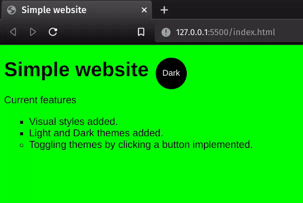

# SIMPLE WEBSITE

## A simple website under development built by using HTML, CSS and JavaScript.

This simple website is being built for practicing purposes. I'll be adding new features as I learn new skills and feel inspired by creativity 😊
___

### Current features

- Visual styles added.
- Light and Dark themes added.
- Toggling themes by clicking a button implemented.
  

___
 

### You're not a programmer and hence you don't know how to run and try this out? Don't worry. **Just follow these steps**:

1. Install [Git](https://git-scm.com/book/en/v2/Getting-Started-Installing-Git).
2. Copy the url from above where says "Code" --> "HTTPS".

2. Open your command line terminal and type the following lines (UNIX, GNU/Linux, Windows [Git Bash](https://youtu.be/sQY0g7s2hac)), pressing [Enter] key after each:

\- `cd Downloads`

\- `git clone [copied link]`

3. Go to your Downloads folder and open the _index.html_ file with your web browser.
4. Enjoy! ❤️
 